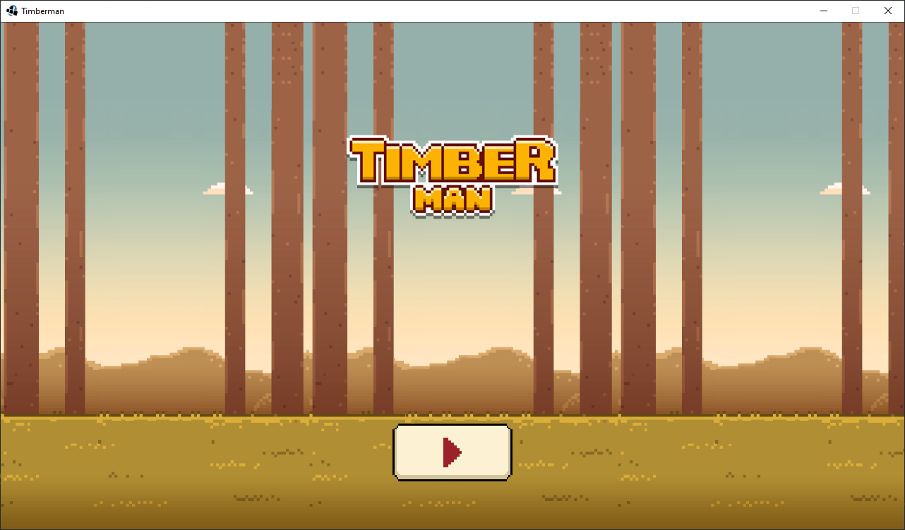
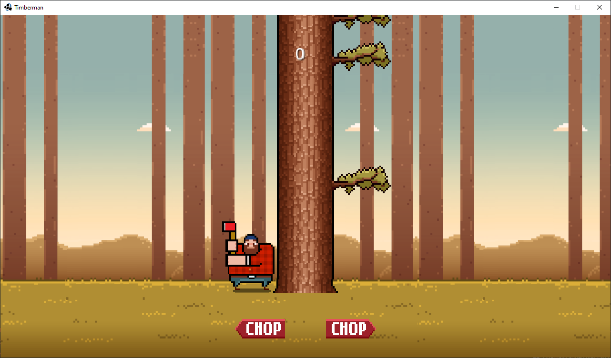
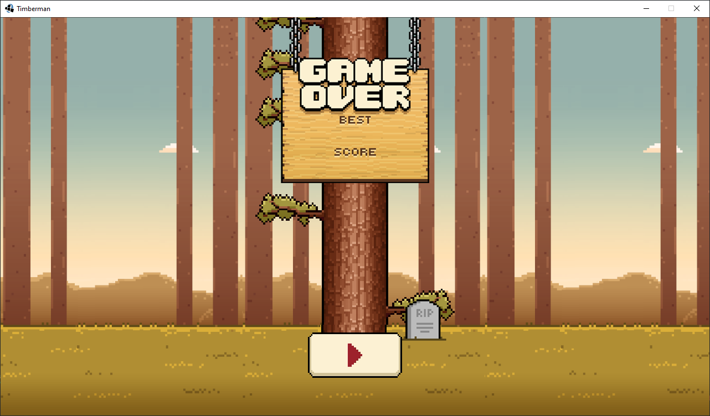

# Timberman Clone

### Simple Timberman clone wrote in Java using [LibGDX](https://libgdx.com/).
Official download link you can find [here](https://github.com/AdiPol1359/Timberman-Clone/releases).

## Requirements
- Java 16 or higher

## How to run game
```
java -jar Timberman.jar
```

## Screenshots




## Contact
<b>AdiPol1359#8770</b>